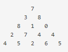

# 정수 삼각형

## 문제

위 그림은 크기가 5인 정수 삼각형의 한 모습이다. 
맨 위층 7부터 시작해서 아래에 있는 수 중 하나를 선택하여 아래층으로 내려올 때, 이제까지 선택된 수의 합이 최대가 되는 경로를 구하는 프로그램을 작성하라. 
아래층에 있는 수는 현재 층에서 선택된 수의 대각선 왼쪽 또는 대각선 오른쪽에 있는 것 중에서만 선택할 수 있다. 
삼각형의 크기는 1 이상 500 이하이다. 
삼각형을 이루고 있는 각 수는 모두 정수이며, 범위는 0 이상 9999 이하이다. 

## 입력
첫째 줄에 삼각형의 크기 n(1 ≤ n ≤ 500)이 주어지고, 
둘째 줄부터 n+1번째 줄까지 정수 삼각형이 주어진다. 

## 출력
첫째 줄에 합이 최대가 되는 경로에 있는 수의 합을 출력한다. 

## 예제 입력1
>5 
>7 
>3 8 
>8 1 0 
>2 7 4 4 
>4 5 2 6 5 

## 예제 출력1
30 